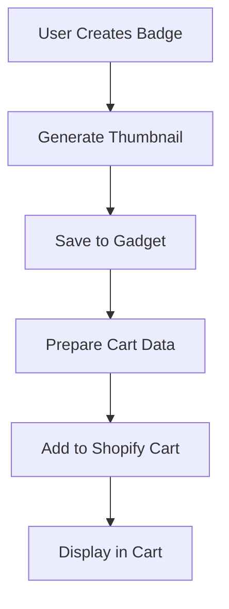

# Shopify Cart Integration Guide for Custom Badge Designs

This guide will help you set up the complete integration between your badge designer app and Shopify cart to display custom badge designs with thumbnails.

## Overview

Your badge designer app now includes:
1. **Enhanced Cart API Integration** - Direct Shopify cart API calls
2. **Improved Thumbnail Generation** - Better canvas-based thumbnails with fallbacks
3. **Updated Cart Template** - Enhanced display of custom badge designs
4. **Fallback Mechanisms** - Multiple ways to add items to cart

## Setup Steps

### 1. Environment Configuration

Add these environment variables to your Vercel deployment:

```bash
# Required for Shopify cart integration
SHOPIFY_STORE_URL=your-store.myshopify.com

# Gadget configuration (already set up)
GADGET_API_URL=https://allqualitybadges-development.gadget.app
GADGET_API_KEY=your-gadget-api-key
```

### 2. Shopify Theme Integration

#### A. Upload Cart Template

1. Copy the updated cart template from `badge-designer-frontend/final-cart-template-for-shopify.liquid`
2. In your Shopify admin, go to **Online Store > Themes**
3. Click **Actions > Edit code**
4. Navigate to `templates/cart.liquid`
5. Replace the content with the updated template

#### B. Add Badge Cart Item Snippet

1. Copy the snippet from `badge-designer/extensions/badge-designer/snippets/badge-cart-item.liquid`
2. In your theme editor, create a new snippet called `badge-cart-item.liquid`
3. Paste the content

### 3. Product Variant Setup

Ensure your Shopify product has the correct variant IDs for different backing types:

```javascript
// Example variant IDs (replace with your actual IDs)
const variantIds = {
  pin: '47037830299903',        // Pin backing
  magnetic: '47037830332671',   // Magnetic backing  
  adhesive: '47037830365439'    // Adhesive backing
};
```

### 4. Test the Integration

#### A. Test Badge Design Creation

1. Open your badge designer
2. Create a custom badge design
3. Click "Add to Cart"
4. Check the browser console for logs

#### B. Verify Cart Display

1. Go to your cart page
2. Verify the custom badge design appears with:
   - Custom thumbnail image
   - Badge text lines
   - Background color swatch
   - Backing type
   - Design ID

## How It Works

### 1. Badge Design Process



### 2. Cart Data Structure

When a badge is added to cart, it includes these properties:

```javascript
{
  variantId: "47037830299903",
  quantity: 1,
  properties: {
    "Custom Badge Design": "Yes",
    "Badge Text Line 1": "John Doe",
    "Badge Text Line 2": "Manager",
    "Badge Text Line 3": "",
    "Badge Text Line 4": "",
    "Background Color": "#FFFFFF",
    "Font Family": "Arial",
    "Backing Type": "pin",
    "Design ID": "design_1234567890_abc123",
    "Gadget Design ID": "gadget_id_123",
    "Custom Thumbnail": "data:image/png;base64,iVBORw0KGgoAAAANSUhEUgAA...",
    "_custom_thumbnail": "data:image/png;base64,iVBORw0KGgoAAAANSUhEUgAA...",
    "Price": "$9.99",
    "Full Design Data": "{\"lines\":[...],\"backgroundColor\":\"#FFFFFF\",...}"
  }
}
```

### 3. Thumbnail Generation

The app generates thumbnails using HTML5 Canvas:

- **Size**: 150x50 pixels (optimized for cart display)
- **Format**: PNG with 80% quality
- **Fallback**: Simple text-based thumbnail if generation fails
- **Storage**: Base64 data URL in cart properties

## Troubleshooting

### Common Issues

#### 1. Thumbnails Not Displaying

**Symptoms**: Cart shows default product image instead of custom badge thumbnail

**Solutions**:
- Check browser console for thumbnail generation errors
- Verify the `Custom Thumbnail` property is being set
- Ensure the cart template is properly updated

#### 2. Cart API Errors

**Symptoms**: "Failed to add badge to cart" error

**Solutions**:
- Verify `SHOPIFY_STORE_URL` environment variable is set
- Check that variant IDs are correct
- Ensure your Shopify store allows cart API access

#### 3. Design Data Not Saving

**Symptoms**: Badge designs not persisting in Gadget

**Solutions**:
- Verify `GADGET_API_KEY` is set correctly
- Check Gadget API URL configuration
- Review server logs for API errors

### Debug Mode

Enable debug logging by checking the browser console. The app logs:

- Badge design data being sent to cart
- Thumbnail generation status
- Cart API responses
- Error details

## Advanced Configuration

### Custom Variant ID Mapping

If your variant IDs don't follow the pattern, update the `getVariantId` function in `BadgeDesigner.tsx`:

```javascript
const getVariantId = (backingType: string, productId?: string | null) => {
  // Add your custom mapping logic here
  const variantMap = {
    pin: 'your-pin-variant-id',
    magnetic: 'your-magnetic-variant-id', 
    adhesive: 'your-adhesive-variant-id'
  };
  
  return variantMap[backingType] || variantMap.pin;
};
```

### Custom Thumbnail Styling

Modify the CSS in the cart template to customize thumbnail appearance:

```css
.custom-badge-thumbnail {
  max-width: 100px;
  height: auto;
  border: 2px solid #007cba;  /* Custom border */
  border-radius: 8px;         /* Rounded corners */
  box-shadow: 0 4px 8px rgba(0,0,0,0.2);  /* Enhanced shadow */
}
```

### Multiple Badge Support

The system supports adding multiple badges with different designs. Each badge will have its own:

- Unique design ID
- Custom thumbnail
- Individual text lines
- Design properties

## Performance Considerations

### Thumbnail Optimization

- Thumbnails are generated client-side to reduce server load
- Base64 encoding is used for immediate display
- Fallback thumbnails prevent display errors

### Cart API Limits

- Shopify Cart API has rate limits
- The app includes fallback mechanisms
- Consider implementing request queuing for high-volume stores

## Security Notes

### Data Validation

- All badge design data is validated before saving
- Thumbnail generation is sandboxed in canvas
- Cart properties are sanitized

### API Key Security

- Gadget API keys are server-side only
- Shopify store URLs are validated
- No sensitive data is exposed to client-side

## Support

If you encounter issues:

1. Check the browser console for error messages
2. Verify all environment variables are set
3. Test with a simple badge design first
4. Review the troubleshooting section above

For additional help, refer to:
- [Shopify Cart API Documentation](https://shopify.dev/docs/api/liquid/objects/cart)
- [Gadget.dev Documentation](https://docs.gadget.dev/)
- [Canvas API Documentation](https://developer.mozilla.org/en-US/docs/Web/API/Canvas_API) 